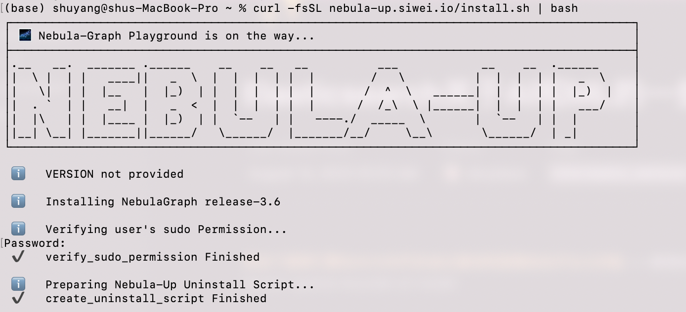

## Create a Graph Space
We use [**Nebula**](https://docs.nebula-graph.io/3.6.0/) here

💡 Do not yet have a NebulaGraph cluster? check out nebula-up, it's a one-liner :


```bash
curl -fsSL nebula-up.siwei.io/install.sh | bash
```


or

see doc here and build with a plugin in graph:https://docs.nebula-graph.io/3.6.0/


[here](./Graph_RAG_LlamaIndex_Workshop.ipynb) is a notebook to create a graph space and load data into it.(and let llm chat with it)
--demo from `llama-index`

## use nebula with llama-index
https://docs.llamaindex.ai/en/stable/examples/index_structs/knowledge_graph/NebulaGraphKGIndexDemo.html
