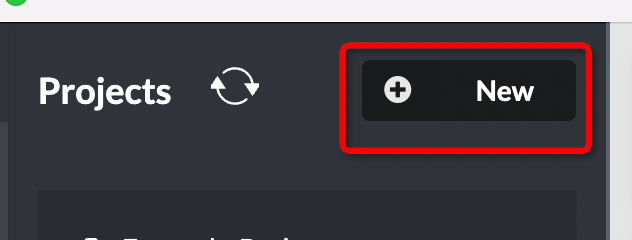
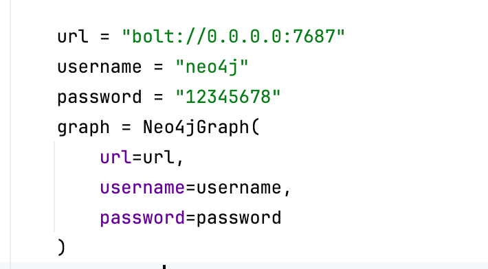

## 使用neo4j作为图数据库（也有向量数据库功能）
首先下载neo4j Desktop :https://neo4j.com/download/?ref=blog.langchain.dev

右上角新建project，主要要记住用户名密码

复制`.env.example`为`.env`，修改其中的key 和 base 注意这里可以修改为本地llm的url，本地启动key可以随便写,参考[api_for_open_llm](/Users/shuyang/Desktop/shucode/llmresearch/llmkg/knowledge_graph/api-for-open-llm/README.md)

修改`./gen_kg_from_docs.py`中的neo4j的用户名密码
图中为默认设置

修改`input_file_path`,其中测试文件位于`test_data` 文件夹下
完整专利知识图构建需要分别运行：test_data下的2-3.csv 专利分类.csv 以及classification.pdf 文件
运行`python gen_kg_from_docs.py` 即可生成图数据库 并储存于neo4j中